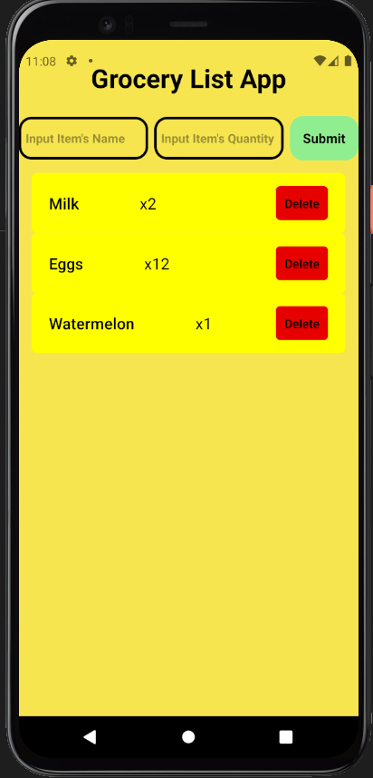

# **Final Project Application**

# **Developers: Mohammed, Binh Pham**

# **About:**
A simple and limited grocery app that built by React Native framework and run on an Android emulator (front-end). The back-end is built by writing sqlite database code, which enables 
the app to retain information even after reload or stopped the server. This is the very first attempt on building a react native app with the goal of learning how to 
implement basic components and understand more UX/UI experience. This app initially took inspirations from AnyList - a more popular and well-designed grocery app. 

# **Software**
Visual Studio Code, Android Studio, and SQLite Studio

# **Functionality**
1. The user are introduced with the ability of adding the item's name and the quantity of the said item.
2. The user have the capability of deleting those items after submittion.
3. The data retainability is in effect even after stopping the server or closing the IDE. 

# **What we have learned**
- Learning to implement basic components and designing experience.
- Working together as a group in order to design an app with strict deadline.
- The fundamental experience of creating a back-end sqlite database.

# **Improvements**
- Implementing FlatList to make rendering better.
- Implementing make more screens with slide-up animation (Modality).
- Adding a custom button with custom Android text as an Edit button.
